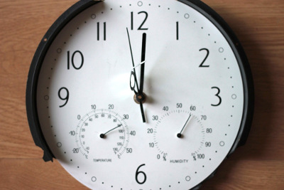
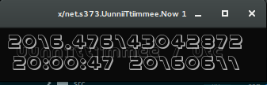

# [uunnii-time](http://andre-sier.com/uunniivveerrssee/uunnii-time)

by André Sier, 2010-11

## uunnii-time

A time format forged by the artist to match the mapping of common time (or any time) to a continuous number from 0 to 1, to equal the percentage of the date in seconds of the selected year.

**uunnii-time**. Simulated time which synchronizes real installations with virtual world. Real simulated virtual time which synchronizes uunniivveerrssee.net simulation.

## uunnii-time-now

This repository holds src code and binaries to look at `now` in uunnii-time format. Binaries are provided for windows, osx and unix.

A lightweight clock which displays time in `uunnii-time` & `utc` formats. Check the release folder to find binaries for your platform. Unix users have to fix ldd, or better to compile from source.

made with Unix Time, [s373.net/x](http://s373.net/x) codex, [Processing](http://processing.org/), [openFrameworks](http://openframeworks.cc/)

## uunnii-time-now
licensed under (cc by-nc-sa)
